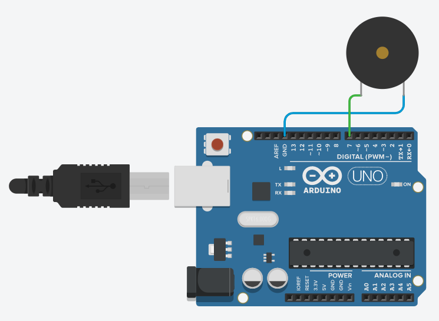

# Active buzzer
엑티브부저 예제

회로도


예제 코드

```cpp
const int pin = 7;

void setup() {
  pinMode(pin, OUTPUT);

}

void loop() {
  digitalWrite(pin, HIGH);
  delay(500);
  digitalWrite(pin, LOW);
  delay(500);
  digitalWrite(pin, HIGH);
  delay(100);
  digitalWrite(pin, LOW);
  delay(100);

}
```
