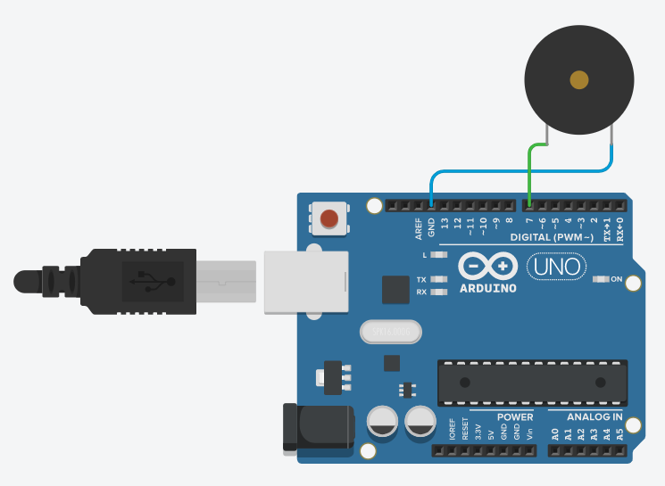

# Piezo_buzzer
피에조 부저 예제

회로도


예제 코드

```cpp
int pin = 7;

int numTones = 8;
int tones[] = {261, 294, 330, 349, 492, 440, 494, 523};
// 도 레 미 파 솔 라 시 도

void setup() {
  pinMode(pin, OUTPUT);
}

void loop() {
  for (int i = 0; i < numTones; i++) {
    tone(pin, tones[i]);
    delay(100);
  }
  noTone(pin);
}
```
