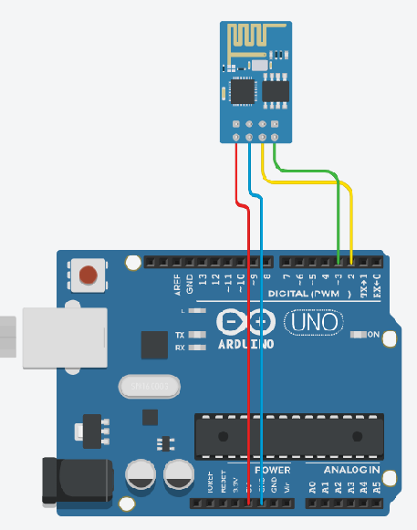

# HM10 serial
아두이노 시리얼통신(HM10 블루투스) 예제 입니다

회로도


예제코드 미리보기
```cpp
#include <SoftwareSerial.h>

#define rx 2 // pin
#define tx 3 
//아두이노	rx]---[tx HM10
//			tx]---[rx HM10

SoftwareSerial HM10(rx, tx);

char data;

void setup() {
  Serial.begin(9600);
  HM10.begin(9600);
}

void loop() {

  if(HM10.available()) { // HM10 에서 받은 데이터가 있을 경우
	  data = HM10.read ( ); // 데이터를 읽어 들여 할당한다.
	  Serial.write ( data );
	  readBLE(data)
  } 
}
void readBLE(char data){
  switch(data){
    case 0x01 :
      Serial.println("ble data is 0x01");
      break;
    
    case 0x02 :
      Serial.println("ble data is 0x02");
      break;
    
    case 0x03 :
      Serial.println("ble data is 0x03");
      break;
    
    case 0x04 :
      Serial.println("ble data is 0x04");
      break;
    
    case 0x05 :
      Serial.println("ble data is 0x05");
      break;
    
    case 0x06 :
      Serial.println("ble data is 0x06");
      break;
    
    case 0x07 :
      Serial.println("ble data is 0x07");
      break;
    
    case 0x08 :
      Serial.println("ble data is 0x08");
      break;
    
    case 0x09 :
      Serial.println("ble data is 0x09");
      break;
  }
}
```
