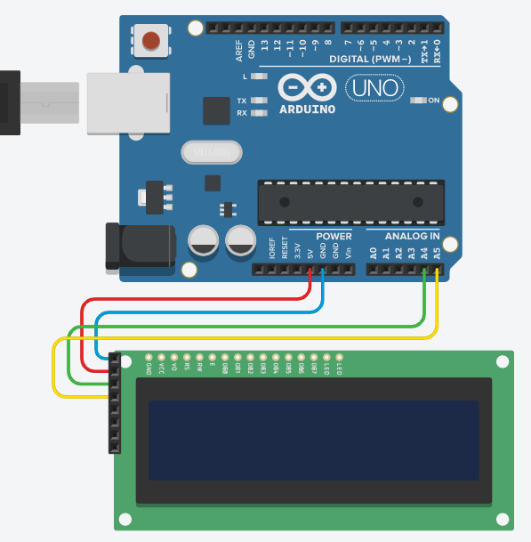

# LCD1602 I2C
LCD 예제 코드

회로도


예제 코드

```cpp
#include <LiquidCrystal_I2C.h> // LCD 1602 I2C용 라이브러리
#include <Wire.h> // i2c 통신을 위한 라이브러리

LiquidCrystal_I2C lcd(0x27, 16, 2); // 접근주소: 0x3F or 0x27
// 뛰어쓰기 포함 최대 16자, 2줄

void setup() {
  lcd.init();
  lcd.backlight();
}

void loop() {
  lcd.setCursor(0, 0); // 1번째, 1라인
  lcd.print("Hello world!");
  lcd.setCursor(0, 1); // 2번 라인
  lcd.print("Hello TAThink!");
  delay(1000);
  lcd.setCursor(0, 0); // 1번째, 1라인
  lcd.print("Hello TAThink!");
  lcd.setCursor(0, 1); // 2번 라인
  lcd.print("Hello world!");
  delay(1000);
  lcd.clear(); // LCD 지우기
  delay(1000);
}
```
