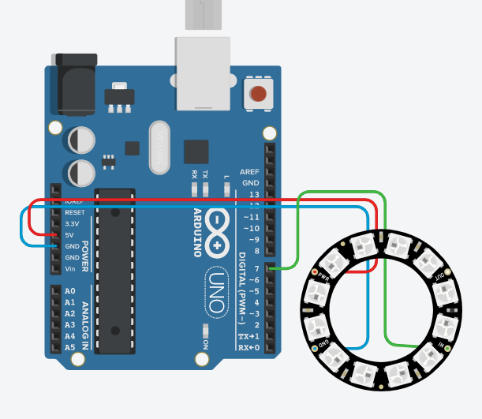

# neopixel
네오 픽셀 예제 코드

회로도


예제 코드

```cpp
#include <Adafruit_NeoPixel.h> // 외부 라이브러리

int pin = 7; // 핀번호
int ledNum = 8; // LED 개수
Adafruit_NeoPixel rgb = Adafruit_NeoPixel(ledNum, pin, NEO_GRB+NEO_KHZ800);

void setup() {
  rgb.begin();
}

void loop() {
  rgb.setPixelColor(0, rgb.Color(100,0,0)); // 첫번째 LED 에 빨간색
  rgb.show(); // 설정한 LED 값을 켜줌
  delay(500);
  rgb.setPixelColor(1, rgb.Color(0,100,0)); // 두번째 LED 에 초록색
  rgb.show();
  delay(500);
  rgb.setPixelColor(2, rgb.Color(0,0,100)); // 세번째 LED 에 파란색
  rgb.show();
  delay(500);
  rgb.setPixelColor(0, rgb.Color(0,0,0)); // 첫번째 LED 를 끕니다.
  rgb.show();
  delay(500);
  rgb.setPixelColor(1, rgb.Color(0,0,0)); // 두번째 LED 를 끕니다.
  rgb.show();
  delay(500);
  rgb.setPixelColor(2, rgb.Color(0,0,0)); // 세번째 LED 를 끕니다.
  rgb.show();
  delay(500);
}
```
