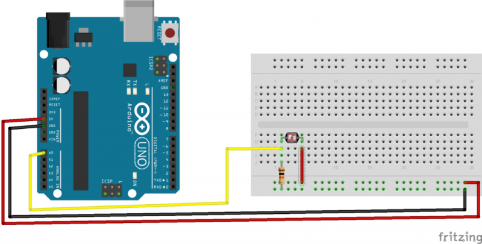
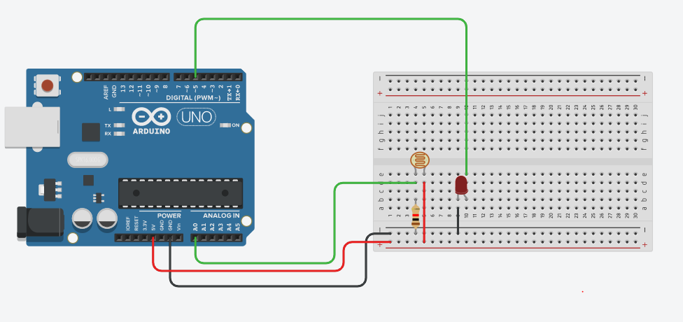

# photo_resistor
조도센서 예제

회로도


예제코드 
```cpp
int pin=A0;  // 핀 번호

int val=0;  //
void setup() 
{ 
  Serial.begin(9600); //set baud rate as 9600 
} 
void loop() 
{ 
  val = analogRead(pin);//read analog 
  Serial.println(val); 
  delay(10); //delay 0.01 s 
}
```

# photo_resistor_EXAMPLE
조도센서 응용예제

회로도


예제코드 
```cpp
void setup()
{
  Serial.begin(9600);
  pinMode(5, OUTPUT);
}

void loop()
{
  int val = analogRead(A0);
  Serial.println(val);
  if(val > 60)
	digitalWrite(5, HIGH);
  else
	digitalWrite(5, LOW);
}
```

