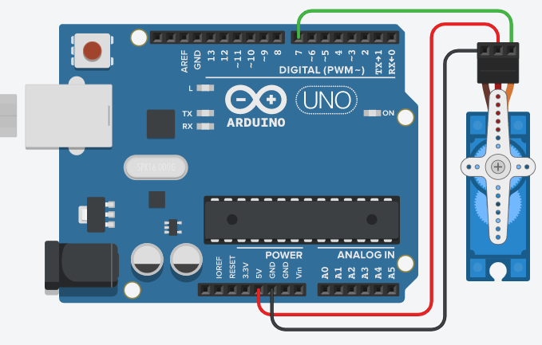

# servo motor
서보 모터 예제 입니다.

회로도


예제 코드

```cpp
#include <Servo.h> // 서보 모터 라이브러리
Servo servo;
int angle = 0; // 0~180도

int pin = 7;

void setup() {
  servo.attach(pin);
  Serial.begin(9600);
}

void loop() {
  servo.write(angle);
}
```
