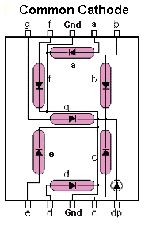
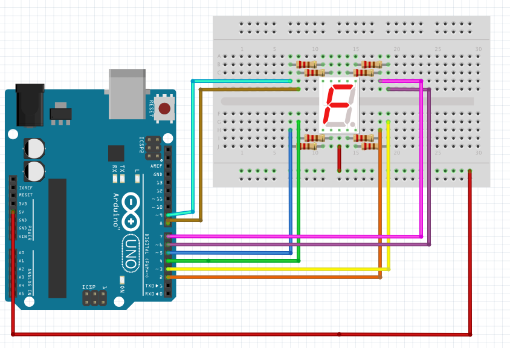

# seven segment
7세그먼트 예제입니다.

회로도 및 모듈





예제 코드입니다.

``` cpp
/*
[8][7][2][3]
    ( 2 )
( 7 )   ( 3 )
    ( 8 )
( 6 )   ( 4 )
    ( 5 )   (9)
[6][5][4][9]
*/

int seg[8] = {2, 3, 4, 5, 6, 7, 8, 9}; // 각 핀번호
int number[][8]= {
  {1, 1, 1, 1, 1, 1, 0, 1}, // 0
  {0, 1, 1, 0, 0, 0, 0, 1}, // 1
  {1, 1, 0, 1, 1, 0, 1, 1}, // 2
  {1, 1, 1, 1, 0, 0, 1, 1}, // 3
  {0, 1, 1, 0, 0, 1, 1, 1}, // 4
  {1, 0, 1, 1, 0, 1, 1, 1}, // 5
  {0, 0, 1, 1, 1, 1, 1, 1}, // 6
  {1, 1, 1, 0, 0, 0, 0, 1}, // 7
  {1, 1, 1, 1, 1, 1, 1, 1}, // 8
  {1, 1, 1, 1, 0, 1, 1, 1}  // 9
};
int numberSize = sizeof(number)/sizeof(number[0]);
int i;
int j;

void setup() {
  for(i = 0; i < 8; i++) {
    pinMode(seg[i], OUTPUT);
  }
}

void loop() {
  for(i = 0; i < numberSize; i++) {
    for(j = 0; j < 8; j++) {
      digitalWrite(seg[j],number[i][j]);
    }
    delay(500);
  }
}
```