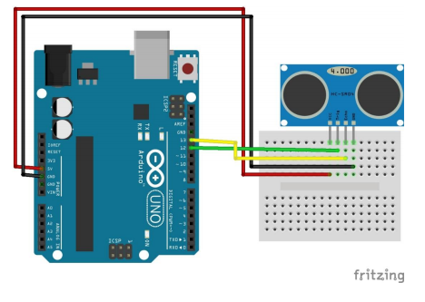

# ultrasonic_sensor
초음파 센서 예제

회로도


예제코드
```cpp
int distance;
int triggerPin = 13;
int echoPin = 12;

void setup() {
  Serial.begin(9600);
  pinMode(triggerPin, OUTPUT);
  pinMode(echoPin, INPUT);
}

void loop() {
  // trigger 핀으로 10㎲의 펄스
  digitalWrite(triggerPin, HIGH);
  delayMicroseconds(10); //microsec 1000*1000 = 1sec
  digitalWrite(triggerPin, LOW);

  // echo 핀으로 cm 단위로 계산
  distance = pulseIn(echoPin, HIGH) / 58;
  // pulseIn(pin, value) : value가 HIGH 라면 LOW 에서 HIGH 가 되는 시점까지 시간
  // pin: 펄스를 읽을 핀 번호
  // value: 읽을 펄스의 유형(HIGH | LOW)
  Serial.print("Distance(cm) =");
  Serial.println(distance);
  delay(1000);
}
```
